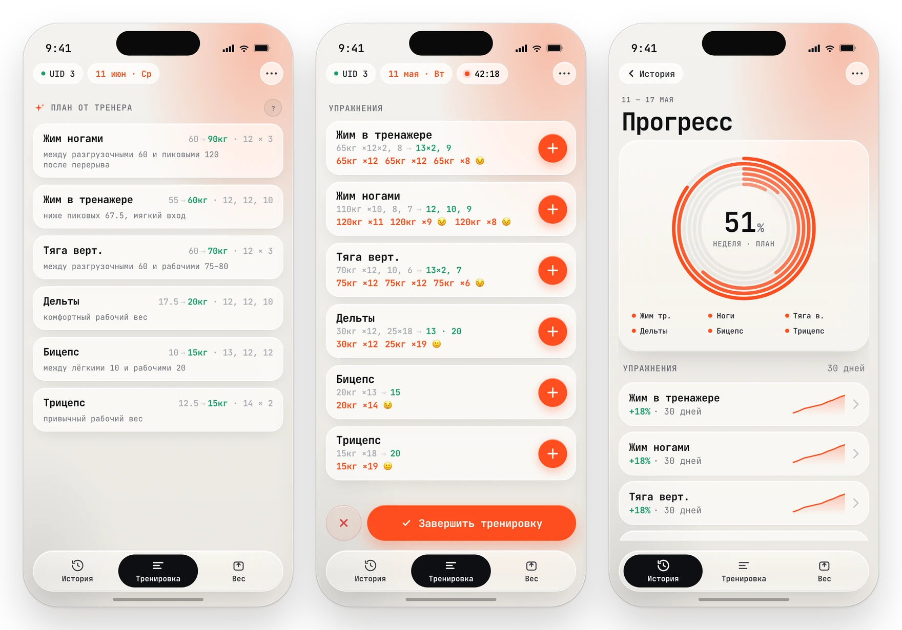
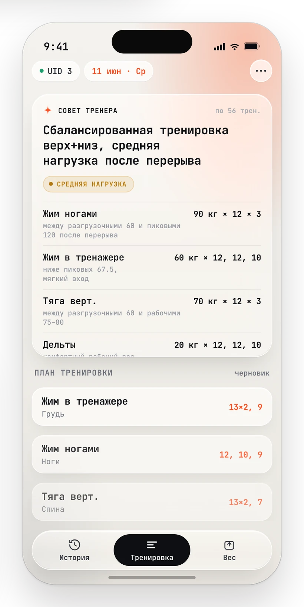
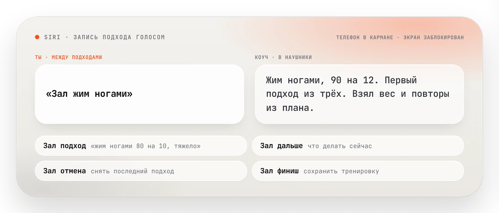
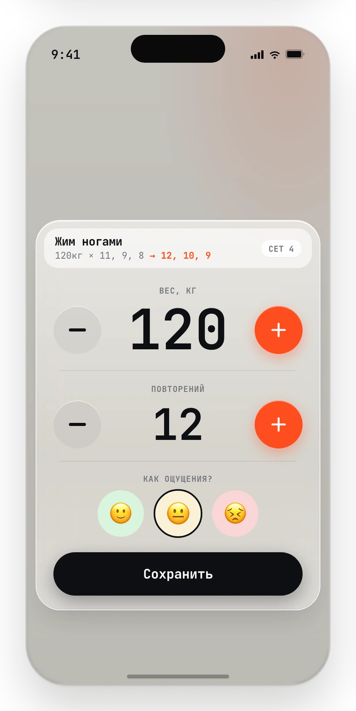
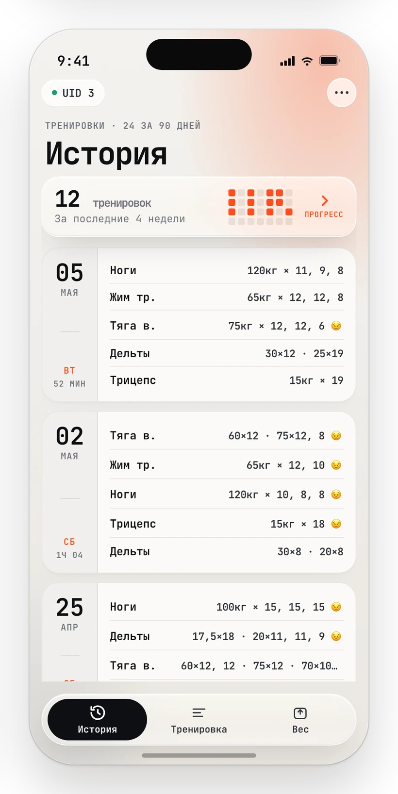
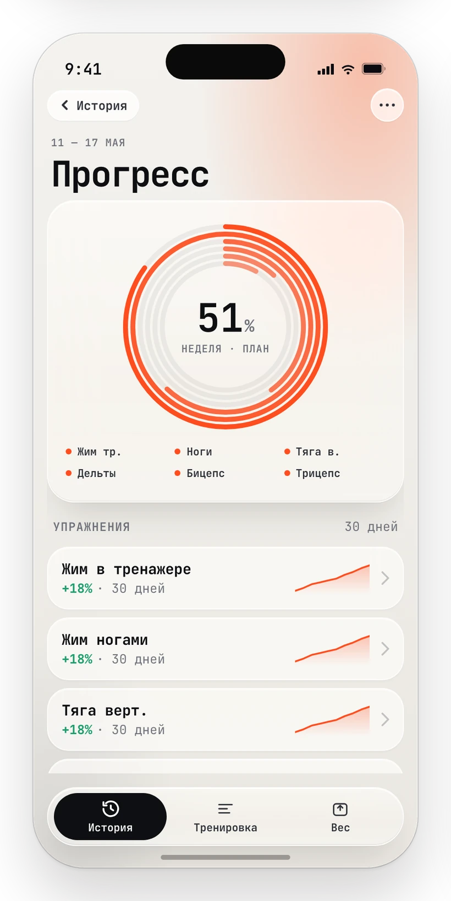
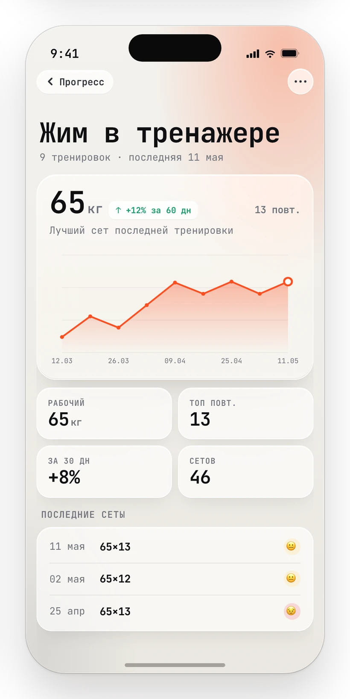
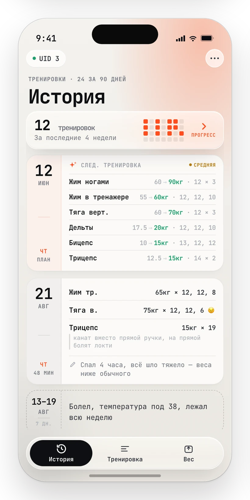
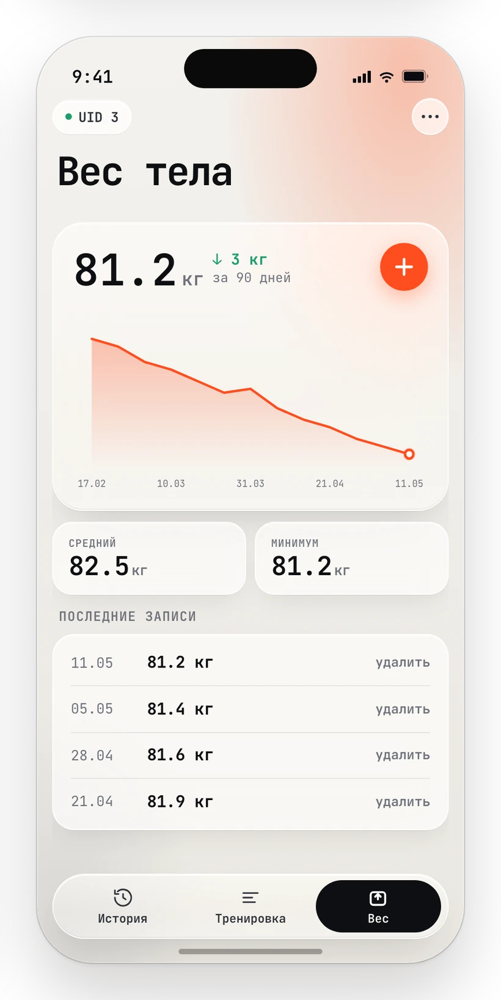

<div align="center">

# Pocket Coach

### Карманный ИИ-тренер по силовым

Ты записываешь подходы — он читает всю историю и говорит, что делать на следующей тренировке:
упражнения, веса, повторы и почему именно так.

<sub><i>Pocket AI strength coach — a SwiftUI app, a self-hosted stdlib-Python backend and next-workout plans written by Claude.</i></sub>

[](https://github.com/Batonec/Pocket-coach/actions/workflows/ci.yml)     



</div>

---

## Совет тренера — план, а не мотивация



**Не «делай базу 3×8», а «жим ногами 90 кг × 12 × 3 — между разгрузочными 60 и пиковыми 120 после перерыва».**

Модель получает не сырую простыню тренировок, а посчитанные фичи: e1RM по Эпли, даты ПР, процент текущего рабочего веса от пика, недельные объёмы по группам с добором эффективных сетов, тренды веса и талии, дисциплину «факт vs план» за 30 дней.

- **Со сроком.** План приходит с ответом «через сколько дней идти», а не абстрактным «на следующей тренировке».
- **С обоснованием.** «Почему так» раскрывается прямо в карточке — видно логику фазы, а не только числа.
- **Применяется в один тап.** Совет становится планом тренировки: карточки встают в порядке рекомендации, «+» подставляет целевой вес.
- **Обновляется сам.** После тренировки, после замера веса или талии и утренним таймером — совет всегда датирован сегодня.
- **Не ломается о методику.** Спорный план уходит модели одним авто-репромптом, а не падает ошибкой.

<sub>Как собирается промпт и что проверяет валидатор — [backend/README.md](./backend/README.md)</sub>

<br clear="all">

## Голос: телефон остаётся в кармане

<div align="center">

</div>

Между подходами телефон лежит заблокированный, в ушах наушники. Достать, разблокировать, найти карточку упражнения, нажать «+» — самая дорогая операция всей тренировки, и она повторяется 20–25 раз за сессию.

Голос убирает её целиком. **«Зал жим ногами»** — подход записан весом и повторами из плана тренера, ответ приходит в наушники. Экран не разблокируется, приложение не выходит на передний план. Свободная фраза («жим ногами 80 на 10, тяжело»), отмена, «что дальше» и завершение тренировки — тоже голосом, по-русски и по-английски.

<sub>Как устроен голосовой слой — [ios/VOICE_LOGGING_BRIEF.md](./ios/VOICE_LOGGING_BRIEF.md)</sub>

## Тренировка в один тап



Новая тренировка открывается сразу карточками основной шестёрки — без пустого экрана и без похода в каталог. В каждой карточке видно прошлое выполнение и план на сегодня одной строкой.

- **«+» знает, что дальше.** Приоритет один на всё приложение: повтор последнего кастомного подхода → цель применённого плана → история +1 повтор.
- **Long press — конструктор подхода** с оценкой тяжести 🙂 / 😐 / 😣, которая потом видна и в истории, и в референсе прошлого выполнения.
- **Кольцо вокруг кнопки** считает не «начал упражнение», а долю реально выполненных плановых подходов.
- **Суперсеты — норма.** Несколько упражнений ведутся параллельно, порядок подходов не навязывается.
- **Ошибся — long press по карточке**: удалить последний подход или всё упражнение целиком.
- **Черновик не теряется** — переживает выход из приложения и возвращает в конструктор с того же места.

<sub>Полное продуктовое поведение экранов — [BUSINESS_LOGIC.md](./BUSINESS_LOGIC.md)</sub>

<br clear="all">

## История и прогресс, которые читаются

<div align="center">



</div>

**История** — компактные строки «упражнение → веса × повторы» вместо простыни подходов, с оценкой тяжести там, где она была.
**Неделя** — кольцо по основной шестёрке, объём по группам и дисциплина за 7 дней.
**Упражнение** — e1RM, рабочий вес, процент от пика и все ПР по одному движению.

## Тренер знает, почему тебя не было



**Дырка в датах ничего не объясняет: болезнь, командировка и лень выглядят одинаково.** После недели гриппа коуч предлагал доболезненные веса — формально ведь ничего не произошло.

- **Событие закрывает разрыв.** Период без тренировок с причиной встаёт в ленте истории ровно в том промежутке, который объясняет. Пока событие открыто, оно значит «сейчас не тренируюсь», и закрывается само первой же тренировкой.
- **Заметка к подходу.** Вес сравним только внутри одной установки: трицепс на канате идёт легче, чем на прямой ручке, и без пометки переход читается как откат силы.
- **Заметка к тренировке** — одна строка на сессию: «спал 4 часа, всё шло тяжело».
- **Ничего из этого не считается.** Единственный вход в промпт, который остаётся словами: ни фичи, ни порога, ни баннера из него не появилось.
- **Слова — не команда.** Текст атлета объявлен модели фактом о контексте: «сделай сегодня полегче» из заметки учитывается как обстоятельство, но политику фаз не отменяет.

<sub>Как контекст доезжает до модели — [BUSINESS_LOGIC.md](./BUSINESS_LOGIC.md)</sub>

<br clear="all">

## Вес, талия и баннеры без ИИ



Вес тела — одна запись на дату, график и удаление тапом по точке. Талия — не косметика, а **граница фазы**: при подходе к лимиту коуч сам меняет тон и правила питания, а замерам старше двух недель просто не верит и просит новый.

Баннеры на экране считает **не модель, а пороги в коде**:

- «пора замерить» и «данные протухли» — прежде чем советовать калории;
- «возврат после перерыва» и «плановый deload» — из фазы подготовки, а не из настроения;
- «неделя закрыта» — с недельным отчётом тренера, который пишется заранее, в ночь на понедельник.

Одинаковые данные всегда дают одинаковый список: баннер можно смахнуть, и он вернётся только новым эпизодом, а не при следующей перерисовке экрана.

<sub>Пороги, severity и жизненный цикл — [docs/COACH_SIGNALS.md](./docs/COACH_SIGNALS.md)</sub>

<br clear="all">

---

## Как это устроено

Три процесса поверх одной базы. `coach_mcp` — не сервис поверх API, а второй процесс поверх того же SQLite: он импортирует те же модули, что и backend, и видит ровно то, что генерирует приложение.

```
iOS (SwiftUI)  ──HTTP + cookie──►  backend/server.py  ──►  SQLite (trainer.db)
                                                              ▲
Claude Desktop ──MCP──►  coach_mcp/server.py  ────────────────┘
```

**Главный инвариант — граница «алгоритм / LLM». Модель вызывается ровно в двух местах:** план следующей тренировки и недельный отчёт. Всё остальное детерминировано.

| Слой | Что делает | LLM |
| --- | --- | :---: |
| [`coach_state.py`](./backend/coach_state.py) | фаза подготовки, неделя блока, ramp объёма, плановый deload, режим возврата после перерыва | — |
| [`coach_features.py`](./backend/coach_features.py) | e1RM, ПР, % от пика, эффективные объёмы, детектор застоя, тренды веса и талии, дисциплина | — |
| [`prompt_builder.py`](./backend/prompt_builder.py) | всё, что читает модель: системный промпт, контекст, фичи, история, JSON-схема; проза — в `prompts/*.md` | — |
| [`recommender.py`](./backend/recommender.py) | оба вызова модели: structured output → валидатор → один авто-репромпт; сам HTTP к API — в [`anthropic_client.py`](./backend/anthropic_client.py) | **да** |
| [`plan_validator.py`](./backend/plan_validator.py) | санитизация ответа и три жёсткие границы: покрытие групп, возвратный потолок весов, потолок сессии | — |
| [`coach_signals.py`](./backend/coach_signals.py) | баннеры: пороги, шаблоны текста, схлопывание семей | — |

Валидатор проверяет **ровно три жёсткие границы**: покрытие мышечных групп, возвратный потолок весов после перерыва и потолок размера сессии фазы. Диапазоны повторов, нижняя граница сессии и чередование нагрузок сознательно не проверяются — это суждение модели, направляемое промптом, а не константы в коде.

**Backend — чистый stdlib Python 3.13**: ни зависимостей, ни venv, ни фреймворка; Claude API вызывается через `urllib`. Тестов — **318 на backend и 142 на iOS**, и это единственный автоматический гейт перед деплоем.

## Документация

| Документ | О чём |
| --- | --- |
| [BUSINESS_LOGIC.md](./BUSINESS_LOGIC.md) | продуктовое поведение и инварианты — главный ответ на «как это должно работать» |
| [backend/README.md](./backend/README.md) | эндпоинты, промпт-пайплайн, фазы, переменные окружения, деплой |
| [ios/README.md](./ios/README.md) | слои клиента, API-контракт, UX «Совета тренера» и голоса |
| [coach_mcp/README.md](./coach_mcp/README.md) | MCP-инструменты: разговор с данными и отладка рекомендаций |
| [docs/COACH_SIGNALS.md](./docs/COACH_SIGNALS.md) | баннеры: пороги, severity, сортировка, снуз |
| [docs/WEEKLY_PROGRESS.md](./docs/WEEKLY_PROGRESS.md) | 7-дневная сводка и её отличие от LLM-отчёта |
| [docs/PRODUCT_BACKLOG.md](./docs/PRODUCT_BACKLOG.md) | отложенное и сознательно не сделанное |
| [design/](./design) | макеты из Claude Design — исходник визуального языка и этих скриншотов |
| [CLAUDE.md](./CLAUDE.md) | карта репозитория для Claude Code: что легко сломать и почему |

## Запуск

<details>
<summary><b>Backend, тесты, iOS</b></summary>

<br>

Всё запускается из корня репозитория; зависимостей и venv у backend нет.

```bash
# backend локально → http://127.0.0.1:8080
MINIAPP_ALLOW_DEBUG_USER=1 python3 backend/server.py
```

```bash
# весь тестовый suite — то же, что гоняет CI
python3 -m unittest discover -s backend/tests -p "test_*.py" -v
```

```bash
# iOS-тесты (из ios/)
xcodebuild -project TrainerIOS.xcodeproj -scheme TrainerIOS -destination 'platform=iOS Simulator,name=iPhone 17' test
```

Генерация советов требует `ANTHROPIC_API_KEY`; без ключа остальные эндпоинты работают.
Деплой: пуш в `main` → CI прогоняет тесты → backend уезжает на VPS, если он затронут.

</details>

## Статус

**Personal build.** Один захардкоженный пользователь (`id=3`), без публичной авторизации и без App Store: это личный инструмент, выложенный открыто, а не продукт для установки. Профиль атлета и состояние подготовки живут только на сервере — в репозитории лежат `*.example.json`.

Веб-мини-апп и Telegram-бот удалены в июне 2026; Android-клиент остался только в истории git.
